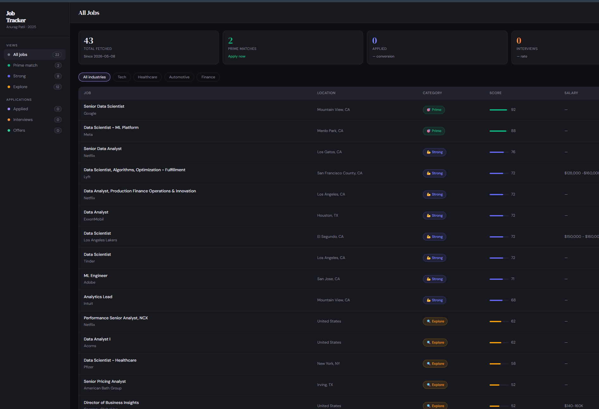

# Job Tracker — LinkedIn Job Pipeline

A personal job search automation tool that scrapes LinkedIn, scores jobs with Claude AI, generates tailored resumes and cover letters, and tracks applications through a dashboard.

---

## Dashboard Preview



---

## What this system does

| Phase | Script | What happens |
|-------|--------|-------------|
| Phase 1 — Scrape | `linkedin_scraper.py` | Fetches today's LinkedIn jobs matching your search criteria |
| Phase 2 — Score | `job_scorer.py` | Claude AI scores each job 0–100 and categorizes it |
| Phase 3 — Tailor | `resume_builder.py` | Generates ATS-optimized resume bullets + cover letter per job |
| Phase 4 — Apply | Dashboard | You review materials and apply manually on LinkedIn |
| Phase 5 — Track | Dashboard | Track application status, interviews, and offers |

---

## Setup

### 1. Install Python dependencies

```bash
pip install requests beautifulsoup4 anthropic flask flask-cors
```

### 2. Get your LinkedIn cookies

1. Open Chrome and log into LinkedIn
2. Press `F12` → **Application** tab → **Cookies** → `https://www.linkedin.com`
3. Copy the values for `li_at` and `JSESSIONID`
4. Create `config/cookies.json`:

```json
{
  "li_at": "your-li_at-value-here",
  "JSESSIONID": "your-JSESSIONID-value-here"
}
```

> Cookies expire every ~30 days — refresh them when scraping stops working.

### 3. Get your Anthropic API key

1. Go to [console.anthropic.com](https://console.anthropic.com)
2. Click **API Keys** → **Create Key**
3. Create `config/config.json`:

```json
{
  "anthropic_api_key": "sk-ant-your-key-here"
}
```

> **Cost estimate:** Scoring ~30 jobs/day ≈ $0.30/day. Resume generation for top matches ≈ $0.20/day. Total: ~$15–18/month.

### 4. Configure your job searches

Open `linkedin_scraper.py` and update `SEARCH_CONFIGS` with your target roles and locations. The default searches cover Data Scientist, Data Analyst, ML Engineer, and Analytics Lead across the US.

---

## Daily Usage

Run these commands whenever you want to check for new jobs:

```bash
# Step 1 — Scrape today's LinkedIn jobs (only posts from last 1–2 days)
python linkedin_scraper.py

# Step 2 — Score new jobs with Claude AI
python job_scorer.py

# Step 3 — Generate tailored resume + cover letter for top matches
python resume_builder.py

# Step 4 — Open the dashboard to review and apply
python api.py
```

Then open [http://localhost:5000](http://localhost:5000) in your browser.

> You don't need to clear the database between runs — the scraper deduplicates automatically.

---

## Dashboard Guide

| Feature | How to use |
|---------|-----------|
| Left sidebar | Filter by category (Prime, Strong, Explore) |
| Industry chips | Filter by Tech / Healthcare / Automotive / Finance |
| Search box | Search by title, company, or location |
| Score bar | Visual fit score — green = Prime, blue = Strong, amber = Explore |
| View button | Opens detail panel with full AI analysis |
| Detail panel | Tailored resume bullets + cover letter, copy to clipboard |
| Status dropdown | Mark as Applied, Phone Screen, Technical, Final, Offer |
| Export CSV | Download all jobs for your records |
| Refresh Data | Pulls latest jobs from the database |

---

## Job Categories

| Category | Score | Meaning |
|----------|-------|---------|
| 🎯 Prime | 85–100 | Near-perfect fit — apply immediately |
| 💪 Strong | 65–84 | Good fit — apply with tailored materials |
| 🔍 Explore | 40–64 | Partial fit — review before applying |
| ⏭ Skip | 0–39 | Poor fit — not recommended |

---

## File Structure

```
Job Tracker/
├── linkedin_scraper.py     ← Phase 1: Scrape LinkedIn
├── job_scorer.py           ← Phase 2: Score with Claude AI
├── resume_builder.py       ← Phase 3: Generate tailored materials
├── api.py                  ← Dashboard backend (Flask)
├── dashboard.html          ← Dashboard frontend
├── assets/
│   └── dashboard-preview.png
├── data/
│   └── jobs.db             ← SQLite database (auto-created)
├── config/
│   ├── cookies.json        ← YOU CREATE THIS (LinkedIn session)
│   ├── config.json         ← YOU CREATE THIS (Anthropic API key)
│   ├── cookies.example.json
│   └── config.example.json
└── logs/
    ├── scraper.log
    ├── scorer.log
    └── resume_builder.log
```

---

## Refreshing LinkedIn Cookies

When scraping stops working, your cookies have expired:

1. Log into LinkedIn in Chrome
2. Press `F12` → **Application** → **Cookies**
3. Copy new `li_at` and `JSESSIONID` values
4. Update `config/cookies.json`
